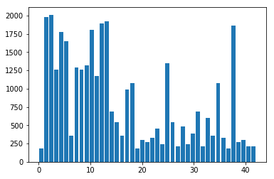

# **Traffic Sign Recognition** 

## Writeup
---

**Build a Traffic Sign Recognition Project**

The goals / steps of this project are the following:
* Load the data set (see below for links to the project data set)
* Explore, summarize and visualize the data set
* Design, train and test a model architecture
* Use the model to make predictions on new images
* Analyze the softmax probabilities of the new images
* Summarize the results with a written report

### Data Set Summary & Exploration

#### 1. Provide a basic summary of the data set. In the code, the analysis should be done using python, numpy and/or pandas methods rather than hardcoding results manually.

I used the python basic functions and numpy functions to calculate summary statistics of the traffic signs data set:

    n_train = len(X_train)
    n_validation = len(X_valid)
    n_test = len(X_test)
    image_shape = np.asarray(X_train[0]).shape
    n_labels = []   # list of labels
    def get_num_classes():
        for _ in train['labels']:
            if _ not in n_labels:
                n_labels.append(_)
        return len(n_labels)
    n_classes = get_num_classes()

* The size of training set is 34799
* The size of the validation set is 4410
* The size of test set is 12630
* The shape of a traffic sign image is (32,32,3)
* The number of unique classes/labels in the data set is 43

#### 2. Include an exploratory visualization of the dataset.
First, I've drawn sample images for each class to see how they look like. 
The train dataset images are pretty centered, but huge brightness range.

And, here is histogram of label frequency, to see how the train dataset is balanced. 

For the test dataset, they are also very centered!

### Design and Test a Model Architecture

#### 1. Describe how you preprocessed the image data. What techniques were chosen and why did you choose these techniques? Consider including images showing the output of each preprocessing technique. Pre-processing refers to techniques such as converting to grayscale, normalization, etc. (OPTIONAL: As described in the "Stand Out Suggestions" part of the rubric, if you generated additional data for training, describe why you decided to generate additional data, how you generated the data, and provide example images of the additional data. Then describe the characteristics of the augmented training set like number of images in the set, number of images for each class, etc.)

I decided to substract mean values form the image through  each channel, and normalized pixel values between -1.0~1.0. 

    # calculate mean w.r.t. channels (R,G,B)
    mean = np.mean(X_train, axis=(0,1,2))

    # Preprocess --> normalize image pixel value between -1.0~1.0
    def img_preprocess(img):
        return (img-mean)/128.
    X_train = img_preprocess(X_train)
    X_valid = img_preprocess(X_valid)
    X_test = img_preprocess(X_test)

And I did not need to augment data, because the test images are very centered too. Without augmentation, my network will be variant to translation, but it will work fine with given test dataset. However, the network may be week to random translated data, and it is discovered from web-image test (Step 3).

#### 2. Describe what your final model architecture looks like including model type, layers, layer sizes, connectivity, etc.) Consider including a diagram and/or table describing the final model.

I've used simple CNN architecture. 
Because the input images have small spatial size(32x32), I have tried to extract fluent features from the original size, so that I have built three 3x3 convolution layers in series at the start. (I also had tried 'Inception-like' convolution layers for the same purpose, with parrallel 4 convolution layers, each 1x1, 3x3, 5x5, 7x7 filter size, however, the former had shown better performance than the inception-like one.)

Here are my network descriptions and codes :

A. Tensorflow version check

    ### Define your architecture here.
    ### Feel free to use as many code cells as needed.
    import tensorflow as tf
    # Tested on tf version "0.12.1" and "1.4.0"
    print("My tensorflow version : {}".format(tf.__version__))

B. Input definition 

    ##### Input place holders
    # X for input image batch
    X = tf.placeholder(tf.float32, (None, image_shape[0], image_shape[1], image_shape[2]), name='X')
    # y for label batch
    y = tf.placeholder(tf.float32, (None, n_classes), name='y')
    # dropout to control dropout ratio
    dropout = tf.placeholder(tf.float32, name='dropout')
    # lr to fine-tune with lower learning rate
    lr = tf.placeholder(tf.float32, name='learning_rate')

C. Define 'base_depth' to adjust network size

    # base_depth to control depth of whole network
    # Higher than '8' had not shown significant performance enhancement, 
    # but just taken longer time to learn. 
    base_depth = 8

D. Feature Extraction from the original size

    ##### conv_1 layers
    # To extract features with series of 3x3 convolution filters. Three of them were enough
    # Maintaing input size, only make depth deeper.
    # Input : 32x32x3
    # conv_1_1 out : 32x32x8
    # conv_1_2 out : 32x32x16
    # conv_1_3 out : 32x32x32
    conv_1_weight   = tf.Variable(tf.truncated_normal([3, 3, 3, base_depth], mean=0.0, stddev=0.1))
    conv_1_bias     = tf.Variable(tf.zeros(base_depth))
    conv_1_1        = tf.nn.conv2d(X, conv_1_weight, [1,1,1,1], padding="SAME", name='conv_1') + conv_1_bias
    conv_1_relu     = tf.nn.relu(conv_1_1) 

    conv_1_2_weight = tf.Variable(tf.truncated_normal([3, 3, base_depth, base_depth*2], mean=0.0, stddev=0.1))
    conv_1_2_bias   = tf.Variable(tf.zeros(base_depth*2))
    conv_1_2        = tf.nn.conv2d(conv_1_relu, conv_1_2_weight, [1,1,1,1], padding="SAME", name='conv_1_2') + conv_1_2_bias
    conv_1_2_relu   = tf.nn.relu(conv_1_2)

    conv_1_3_weight = tf.Variable(tf.truncated_normal([3, 3, base_depth*2, base_depth*4], mean=0.0, stddev=0.1))
    conv_1_3_bias   = tf.Variable(tf.zeros(base_depth*4))
    conv_1_3        = tf.nn.conv2d(conv_1_2_relu, conv_1_3_weight, [1,1,1,1], padding="SAME", name='conv_1_3') + conv_1_3_bias
    conv_1_3_relu   = tf.nn.relu(conv_1_3)

E. Max-Pooling to reduce feature size

    ##### conv_1_3_pool layer
    # First reduction in size
    # Input : 32x32x32
    # Output: 16x16x32
    conv_1_3_pool   = tf.nn.max_pool(conv_1_3_relu, ksize=[1, 2, 2, 1], strides=[1, 2, 2, 1], padding='SAME')

F. Second convolution to extract features

    ##### conv_2 layers
    # Convolution with 5x5 filter
    # Empirically, 5x5 had shown better performance than 3x3
    # With 5x5 filters and 'VALID' padding strategy, feature size reduces without pooling
    # Input : 16x16x32
    # Output: 12x12x64
    conv_2_weight   = tf.Variable(tf.truncated_normal([5, 5, base_depth*4, base_depth*8], mean=0.0, stddev=0.1))
    conv_2_bias     = tf.Variable(tf.zeros(base_depth*8))
    conv_2          = tf.nn.conv2d(conv_1_3_pool, conv_2_weight, [1,1,1,1], padding="VALID", name='conv_2') + conv_2_bias
    conv_2_relu     = tf.nn.relu(conv_2)

G. Third convolution to extract features

    ##### conv_3 layers  ( Same strategy as conv_2 )
    # Convolution with 5x5 filter
    # Empirically, 5x5 had shown better performance than 3x3
    # With 5x5 filters and 'VALID' padding strategy, feature size reduces without pooling
    # Input : 12x12x64
    # Output: 8x8x128
    conv_3_weight   = tf.Variable(tf.truncated_normal([5, 5, base_depth*8, base_depth*16], mean=0.0, stddev=0.1))
    conv_3_bias     = tf.Variable(tf.zeros(base_depth*16))
    conv_3          = tf.nn.conv2d(conv_2_relu, conv_3_weight, [1,1,1,1], padding="VALID", name='conv_3') + conv_3_bias
    conv_3_relu     = tf.nn.relu(conv_3)

H. Flattening and Dropout

    ##### fc0 layers  
    # Flatten and Dropout
    # Not tested various value of dropout-ratio. 
    # Only 0.5 and 0.8 I had tried, and these had shown not much difference in learning curve.
    # Input : 8x8x128
    # Output: 8192
    fc0     = tf.contrib.layers.flatten(conv_3_relu)
    fc0_dropout = tf.nn.dropout(fc0, dropout)

I. Fully-connected to extract logits

    ##### fc1, fc2, fc3 layers  
    # Fully connection to extract logits
    # Decreased in three steps, rather than directly extracting
    # Size of fc1 was sensitive to the accurary. With smaller, significantly lower accurary.
    # Input : 8192
    # fc1 output: 1024
    # fc2 output: 256
    # fc3 output: 43 (The number of classes)
    fc1_w   = tf.Variable(tf.truncated_normal([8*8*base_depth*16, 1024], mean=0.0, stddev=0.1))
    fc1_b   = tf.Variable(tf.zeros(1024))
    fc1     = tf.matmul(fc0, fc1_w) + fc1_b

    fc2_w = tf.Variable(tf.truncated_normal([1024, 256], mean=0.0, stddev=0.1))
    fc2_b = tf.Variable(tf.zeros(256))
    fc2   = tf.matmul(fc1, fc2_w) + fc2_b

    fc3_w = tf.Variable(tf.truncated_normal([256, n_classes], mean=0.0, stddev=0.1))
    fc3_b = tf.Variable(tf.zeros(n_classes))
    logits = tf.matmul(fc2, fc3_w) + fc3_b

J. Cross Entropy , L2 Regularizer and Loss

    ##### Cross entropy
    cross_entropy = tf.nn.softmax_cross_entropy_with_logits(logits=logits, labels=y)

    ##### L2 Regularizer
    regular = tf.nn.l2_loss(conv_1_weight) + tf.nn.l2_loss(conv_1_2_weight) + tf.nn.l2_loss(conv_1_3_weight) + \
              tf.nn.l2_loss(conv_2_weight) + tf.nn.l2_loss(conv_3_weight) + tf.nn.l2_loss(fc1_w) + \
              tf.nn.l2_loss(fc2_w) + tf.nn.l2_loss(fc3_w)
            
    ##### Loss
    loss = tf.reduce_mean(cross_entropy) + 0.0001*regular

K. Optimizer

    ##### Optimizer and Training step
    ##### RMSProp and Adam had shown better, than normal Gradient Descent
    train_step = tf.train.AdamOptimizer(lr).minimize(loss) 
 

#### 3. Describe how you trained your model. The discussion can include the type of optimizer, the batch size, number of epochs and any hyperparameters such as learning rate.

To train the model, I used an Adam optimizer for 35 epochs with batch size of 32.

    epoch = 35
    batch_size = 32
    num_batch = int(n_train/batch_size)

For the optimizer, I had tried three, SGD, RMSProp and Adam. These had shown not much difference at final accuracy, but I've got the best speed with Adam. And, I had found that it converged in 30 epoch and never get better with more train, even with fine-tuning. 

For learning rate, I've started from 0.01, but the network had diverged with that big value. After changing to 0.001, the network started to converge. I just had found 0.0005 as better one, emprically. With lower learning rate (0.00005, 0.000005) and more epochs, I had tried to do fine-tuning, but it had all failed. 

#### 4. Describe the approach taken for finding a solution and getting the validation set accuracy to be at least 0.93. Include in the discussion the results on the training, validation and test sets and where in the code these were calculated. Your approach may have been an iterative process, in which case, outline the steps you took to get to the final solution and why you chose those steps. Perhaps your solution involved an already well known implementation or architecture. In this case, discuss why you think the architecture is suitable for the current problem.

My final model results were:
* training set accuracy of 0.999
* validation set accuracy of 0.978 
* test set accuracy of 0.968

    validation accuracy : 0.9777777777777777
    test accuracy : 0.968487727604305
    train accuracy : 0.9989942239719533

If an iterative approach was chosen:
* What was the first architecture that was tried and why was it chosen?
 First, I tried just simple CNN with filter size 3x3, four layers of conv-relu-pooling combination. But it was not enough. The reason I chose 3x3 as filter size was that I understand VGG network, and it tells that several 3x3 filters give effect of bigger filter size. (Series of two 3x3 --> 5x5) 
 Second, I tried inception-like network for the first convolution layer, with parrallel 1x1, 3x3, 5x5, 7x7 size filters each. With this, I got almoset 0.93, but I had not satisfied.
 Finally, I tried to build three consecutive conv layers without reducing feature size. The reason I got this approach was :
    . Input image was relatively small. So, I thought that too much expression could be lost with pooling.
    . In the training image, the object was very centered and occupied wide region of the image. 

* What were some problems with the initial architecture?
 Shallow network could be problematic, and wrong filter size could be, too. After chaning the filter size to 5x5 from 3x3 in the second/third layers, I could have gotten much accuracy gain. 

* How was the architecture adjusted and why was it adjusted? Typical adjustments could include choosing a different model architecture, adding or taking away layers (pooling, dropout, convolution, etc), using an activation function or changing the activation function. One common justification for adjusting an architecture would be due to overfitting or underfitting. A high accuracy on the training set but low accuracy on the validation set indicates over fitting; a low accuracy on both sets indicates under fitting.
 Most of these are explained above. One thing I want to describe more is about 'base_depth'. I had no idea that 'how big network I need', therefore, I coded the network to adjust depth easy. I had found that, with 'base_depth=8', the netowkr showed great results!

* Which parameters were tuned? How were they adjusted and why?
 Most of these are explained above, too. 

* What are some of the important design choices and why were they chosen? For example, why might a convolution layer work well with this problem? How might a dropout layer help with creating a successful model?
 The important design choice was deploying three conv-relu layers at the first without reducing feature size. Deeper network showed better performance rather that a single wide filter. 

### Test a Model on New Images

#### 1. Choose five German traffic signs found on the web and provide them in the report. For each image, discuss what quality or qualities might be difficult to classify.

Here are five German traffic signs that I found on the web:

The first and fifth images might be easy to classify, because they are very clear, and have very similar shape to train-dataset.
The others are chosen to test how my network is varient to translation with regard to rotation, color, size. 

#### 2. Discuss the model's predictions on these new traffic signs and compare the results to predicting on the test set. At a minimum, discuss what the predictions were, the accuracy on these new predictions, and compare the accuracy to the accuracy on the test set (OPTIONAL: Discuss the results in more detail as described in the "Stand Out Suggestions" part of the rubric).

Here are the results of the prediction:

| Image			        |     Prediction	(confidence)				| 
|:---------------------:|:---------------------------------------------:| 
| General caution     	| General caution	(0.89)						| 
| Stop     			    | General caution	(0.45)						|
| 30 km/h    			| 30 km/h			(1.00)						|
| Straight or Right		| Straight or Right	(0.92)		 				|
| Road work 			| Road work         (0.99)						|

The model was able to correctly guess 4 of the 5 traffic signs, which gives an accuracy of 80%. Since the number of data is too small (only 5), I can't sure that the network statically works how. However, according to the confidence value, it is quite obvious that the network functions in right way.

#### 3. Describe how certain the model is when predicting on each of the five new images by looking at the softmax probabilities for each prediction. Provide the top 5 softmax probabilities for each image along with the sign type of each probability. (OPTIONAL: as described in the "Stand Out Suggestions" part of the rubric, visualizations can also be provided such as bar charts)

The code for making top-5 predictions on my final model is here:

    top_5 = tf.nn.top_k(img_prediction, k=5)
    t5_val, t5_idx = sess.run(top_5)

    for i in range(num_img):
        print("\n\nImage")
        plt.imshow(img_data[i])
        plt.show()
        for k in range(5):
            print("label : {}".format(t5_idx[i][k]), \
                  "Confidence : %1.5f" % (img_prediction[i][t5_idx[i][k]]/sum_prediction[i]))

And, the results are:

    <Image #1>
    label : 15 Confidence : 0.89200
    label : 22 Confidence : 0.10738
    label : 32 Confidence : 0.00038
    label : 1 Confidence : 0.00016
    label : 29 Confidence : 0.00007

    <Image #2>
    label : 12 Confidence : 0.45451
    label : 11 Confidence : 0.29028
    label : 20 Confidence : 0.09231
    label : 27 Confidence : 0.05661
    label : 6 Confidence : 0.04456

    <Image #3>
    label : 1 Confidence : 1.00000
    label : 4 Confidence : 0.00000
    label : 0 Confidence : 0.00000
    label : 5 Confidence : 0.00000
    label : 32 Confidence : 0.00000

    <Image #4>
    label : 36 Confidence : 0.91820
    label : 38 Confidence : 0.06058
    label : 5 Confidence : 0.00939
    label : 41 Confidence : 0.00309
    label : 20 Confidence : 0.00246

    <Image #5>
    label : 25 Confidence : 0.99964
    label : 31 Confidence : 0.00033
    label : 29 Confidence : 0.00003
    label : 14 Confidence : 0.00001
    label : 22 Confidence : 0.00000

Confidence values show great results in the test images, except for 'Stop sign'.
For this 'Stop sign', the network worked awful. I guess that my network is weak for rotated image and augmentation of training set can help this.

### (Optional) Visualizing the Neural Network (See Step 4 of the Ipython notebook for more details)
#### 1. Discuss the visual output of your trained network's feature maps. What characteristics did the neural network use to make classifications?

